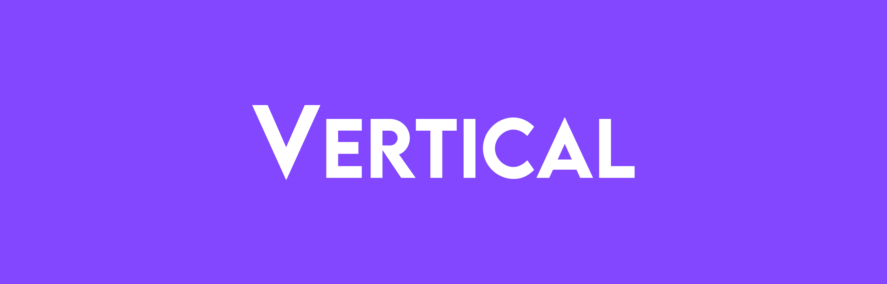

[![Contributors][contributors-shield]][contributors-url]
[![MIT License][license-shield]][license-url]
[![Forks][forks-shield]][forks-url]
[![Stargazers][stars-shield]][stars-url]
[![Issues][issues-shield]][issues-url]
[![LinkedIn][linkedin-shield]][linkedin-url]

 

  

  

    Created by Ethan West, Arthur Dolimier, Nick Gibson, Shawn Rodgers, and Matt Alongi</a>
     
     
  

<h2>About the Project</h2>

 

    </img>

 

For the final project in our app development class, our group leader ethan led us to create Vertical, a social media app for climbers. Being an active climber himself, he wanted to create an app for climbers to share photos, videos, and information about the climbs they complete. He showed us various resources that already exist, such as <a href="https://www.mountainproject.com/" target="_blank">Mountain Project</a>, and <a href="https://www.8a.nu/" target="_blank">8a</a>. However he felt that these lack certain features that the climbing community would appreciate. The goal of Vertical was to create an app that would encompass all the features necessary to connect the climbing community. 

Organization was important to the success of our project as it would prove to have many moving parts. We organized tasks and kept track of progress using <a href="https://www.trello.com" target="_blank">Trello</a>. We planned the UI and UX using <a href="https://www.figma.com" target="_blank">Figma</a>.

 

    </img>

 

As you may have expected, we weren't able to build a social media app ready to ship in a single semester. However, being that none of us had any experience with app development before this class, I think we got a very good amount done. By the day of our presentation, we had included functionality for users to

- create and sign in to their accounts
- post about their climbs
- search for other users, area, and climbs
- scroll through a feed of posts from the users they follow.

As well as other various features. The app still has plenty of bugs to be dealt with, but we are unsure of whether or not we will continue on with development after the end of the semester. Overall this was a great project. We all learned alot and came out with a cool app to showcase.

 

    </img>

 

(<a href="#readme-top">back to top</a>)

<!-- LICENSE -->
## License

Distributed under the MIT License. See `LICENSE` for more information.

(<a href="#readme-top">back to top</a>)

<!-- CONTACT -->
## Contact

### Shawn

Mail - me@directedbyshawn.com

Website - [directedbyshawn.com](https://www.directedbyshawn.com)

LinkedIn - [linkedin.com/in/directedbyshawn](https://www.linkedin.com/in/directedbyshawn)

(<a href="#readme-top">back to top</a>)

<!-- ACKNOWLEDGMENTS -->
## Resources

### Dependencies
* [abseil](https://swiftpackageindex.com/google/abseil-cpp-binary)
* [gRPC](https://github.com/grpc/grpc-swift)
* [firebase](https://github.com/firebase/firebase-ios-sdk)
* [GoogleAppMeasurement](https://github.com/google/GoogleAppMeasurement)
* [GoogleDataTransport](https://github.com/google/GoogleDataTransport)
* [GoogleUtilities](https://github.com/google/GoogleUtilities)
* [GTMSessionFetcher](https://github.com/google/gtm-session-fetcher)
* [leveldb](https://github.com/emilwojtaszek/leveldb-swift)
* [nanopb](https://github.com/nanopb/nanopb)
* [Promises](https://github.com/google/promises)
* [RefreshableScrollView](https://github.com/phuhuynh2411/RefreshableScrollView)
* [SDWebimageSwiftUI](https://github.com/SDWebImage/SDWebImageSwiftUI)
* [SwiftProtobuf](https://github.com/apple/swift-protobuf/releases)

### Other
* [Firebase](https://firebase.google.com/)
* [SwiftUI](https://developer.apple.com/xcode/swiftui/)
* [Figma](https://www.figma.com/)
* [Trello](https://www.trello.com)
* [MountainProject](https://www.mountainproject.com/)
* [8a](https://www.8a.nu/)

(<a href="#readme-top">back to top</a>)

<!-- MARKDOWN LINKS & IMAGES -->
<!-- https://www.markdownguide.org/basic-syntax/#reference-style-links -->
[contributors-shield]: https://img.shields.io/github/contributors/ewestthan/Vertical.svg?style=for-the-badge
[contributors-url]: https://github.com/ewestthan/Vertical/graphs/contributors
[license-shield]: https://img.shields.io/github/license/othneildrew/Best-README-Template.svg?style=for-the-badge
[license-url]: https://github.com/directedbyshawn/Hands-Free/LICENSE.txt
[forks-shield]: https://img.shields.io/github/forks/ewestthan/Vertical.svg?style=for-the-badge
[forks-url]: https://github.com/ewestthan/Vertical/network/members
[stars-shield]: https://img.shields.io/github/stars/ewestthan/Vertical.svg?style=for-the-badge
[stars-url]: https://github.com/ewestthan/Vertical/stargazers
[issues-shield]: https://img.shields.io/github/issues/ewestthan/Vertical.svg?style=for-the-badge
[issues-url]: https://github.com/ewestthan/Vertical/issues
[linkedin-shield]: https://img.shields.io/badge/-LinkedIn-black.svg?style=for-the-badge&logo=linkedin&colorB=555
[linkedin-url]: https://linkedin.com/in/directedbyshawn